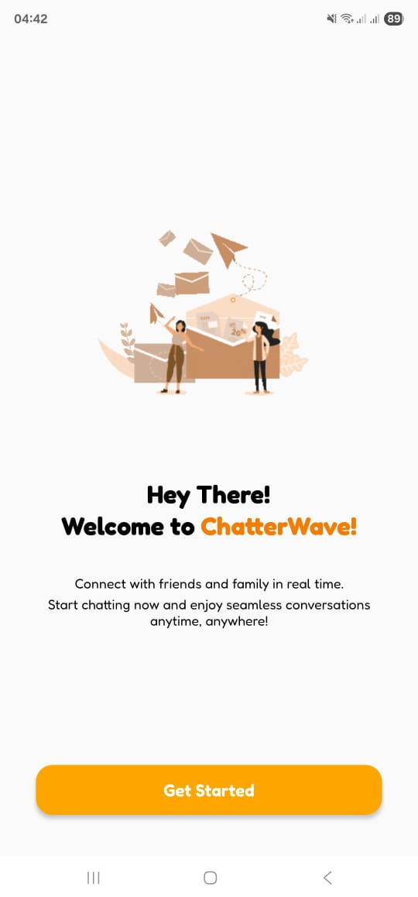
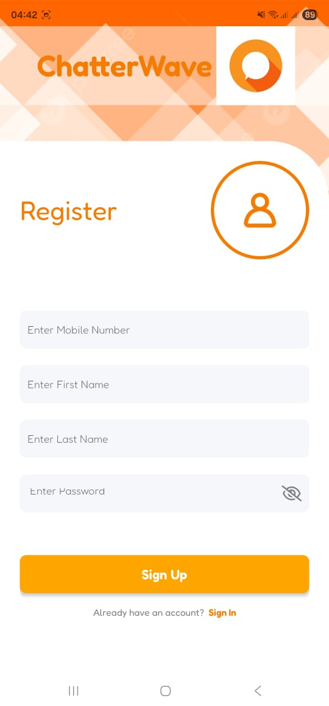
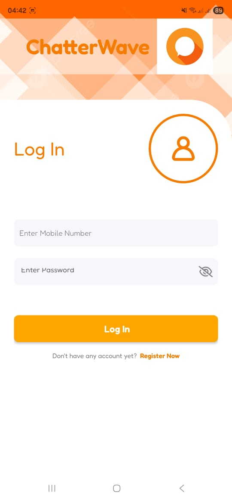
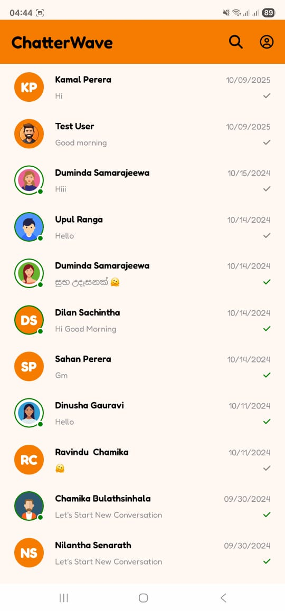
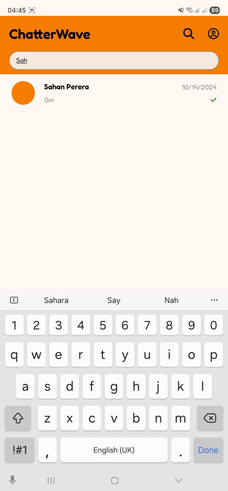
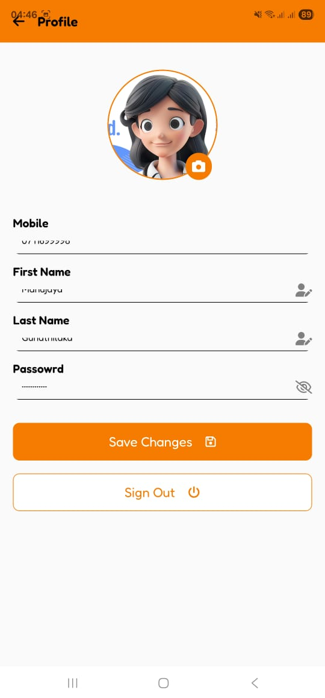

# Chatterwave - Mobile Client (React Native)

<p align="center">
  
  
  
</p>

This is the official mobile frontend for **Chatterwave**, a modern and real-time chat application built with React Native and the Expo framework. It communicates with a robust Java backend to deliver a seamless messaging experience.

➡️ **Backend Repository:** [**Chatterwave-Backend (Java)**](https://github.com/manujayagunathilaka/ChatterWave-Back-End)

<br/>

## Application Screenshots

Welcome to the visual tour of Chatterwave! Below are some key screens showcasing the application's features and user interface.

<table>
  <tr>
    <td align="center">
      
      <br />
      <sub><b>Welcome Screen</b></sub>
    </td>
    <td align="center">
      
      <br />
      <sub><b>Registration Screen</b></sub>
    </td>
    <td align="center">
      
      <br />
      <sub><b>Login Screen</b></sub>
    </td>
  </tr>
  <tr>
    <td align="center">
      
      <br />
      <sub><b>Home (Chat List)</b></sub>
    </td>
    <td align="center">
      
      <br />
      <sub><b>Chat Screen</b></sub>
    </td>
    <td align="center">
      
      <br />
      <sub><b>Search Screen</b></sub>
    </td>
  </tr>
   <tr>
    <td align="center" colspan="3">
      
      <br />
      <sub><b>User Profile Screen</b></sub>
    </td>
  </tr>
</table>

<br/>

## Key Features

* **User Authentication:** Secure user registration and login functionality.
* **Real-Time Chat:** Instantly send and receive text messages.
* **Conversation Management:** Main screen lists all conversations, with the most recent chat appearing at the top.
* **User Search:** Easily find and start conversations with other registered users.
* **Profile Management:** View and update user profiles. The app requests permissions for **Camera and Image Gallery access**, allowing users to capture a new photo or select an existing one for their profile picture.
* **Modern UI:** A clean and intuitive user interface built with custom fonts, gradients, and optimized images.
* **Splash Screen:** A professional loading screen while the app initializes.

<br/>

## Technology Stack

* **Framework:** React Native
* **Platform:** Expo (SDK 54)
* **UI & Components:**
    * `@expo/vector-icons` (FontAwesome)
    * `expo-linear-gradient`
    * `expo-image`
* **Functionality Modules:**
    * `expo-font`
    * `expo-splash-screen`
    * `expo-image-picker`
    * `expo-constants` & `expo-linking` (Dependencies for Expo Router)
    * `react-native-screens` & `react-native-safe-area-context`

<br/>

## Getting Started

Follow these instructions to get the project up and running on your local machine for development and testing purposes.

### Prerequisites

* Node.js (LTS version recommended)
* Git version control
* Expo Go application installed on your physical Android or iOS device.

### Installation & Setup

1.  **Clone the Repository:**
    ```bash
    git clone [https://github.com/your-username/Chatterwave-Front-End.git](https://github.com/your-username/Chatterwave-Front-End.git)
    cd Chatterwave-Frontend
    ```

2.  **Install Dependencies:**
    This will install all the required packages from `package.json`.
    ```bash
    npm install
    ```

3.  **Configure Backend API URL via `.env` file:**
    This project uses an `.env` file to manage environment variables, making it easy to set the backend URL.

    * In the root directory of the project, create a file named `.env`.
    * Add the following line to your new `.env` file. Replace the placeholder URL with the actual public URL provided by your `ngrok` terminal.

        ```env
        EXPO_PUBLIC_URL="[https://your-unique-id.ngrok-free.app](https://your-unique-id.ngrok-free.app)"
        ```

    * You can now access this URL anywhere in your application's JavaScript code using `process.env.EXPO_PUBLIC_URL`.

        **Example Usage (e.g., in an api.js file):**
        ```javascript
        const API_URL = process.env.EXPO_PUBLIC_URL;

        export const loginUser = async (credentials) => {
          // Use the API_URL in your fetch call
          const response = await fetch(`${API_URL}/api/auth/login`, {
            method: 'POST',
            headers: { 'Content-Type': 'application/json' },
            body: JSON.stringify(credentials),
          });
          return response.json();
        };
        ```
    > **Note:** It is standard practice to add your `.env` file to `.gitignore` to prevent sensitive keys from being committed to version control.

4.  **Run the Application:**
    Start the Metro development server.
    ```bash
    npx expo start
    ```
    Scan the QR code shown in the terminal with your phone's camera or the Expo Go app.

<br/>

## 📄 License

This project is licensed under the [MIT License](./LICENSE.md). See the `LICENSE.md` file for details.
